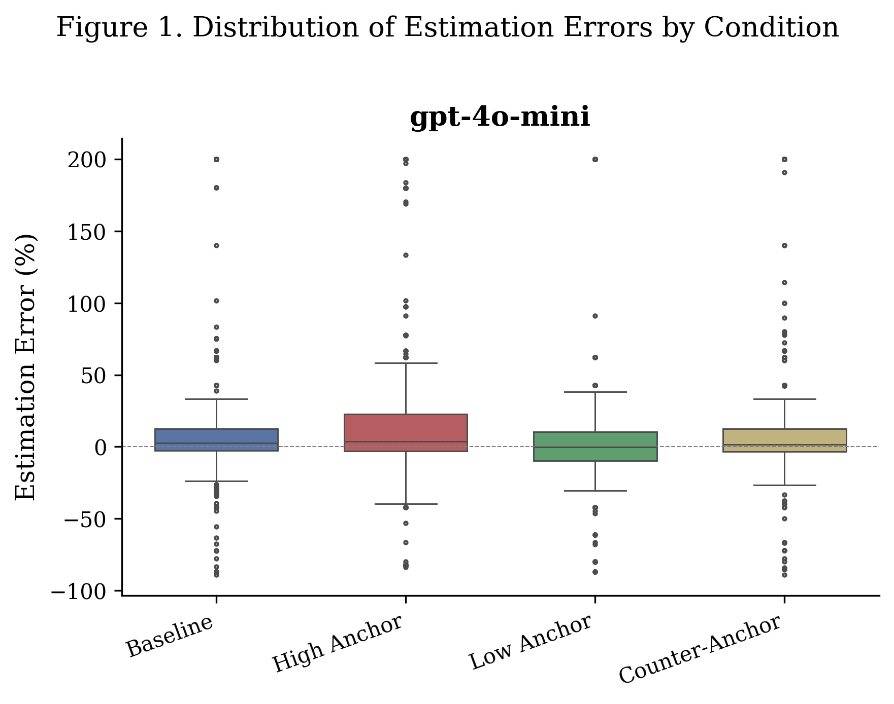
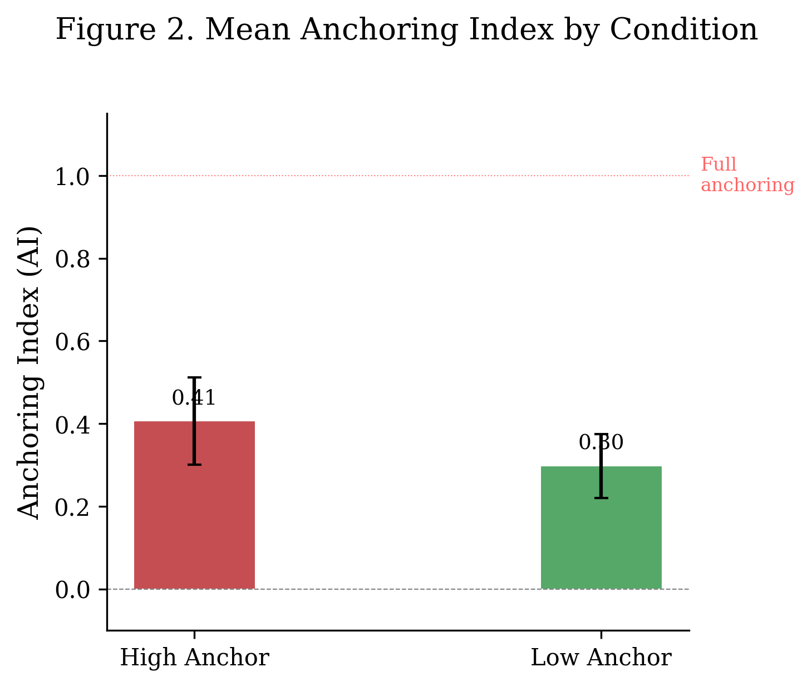
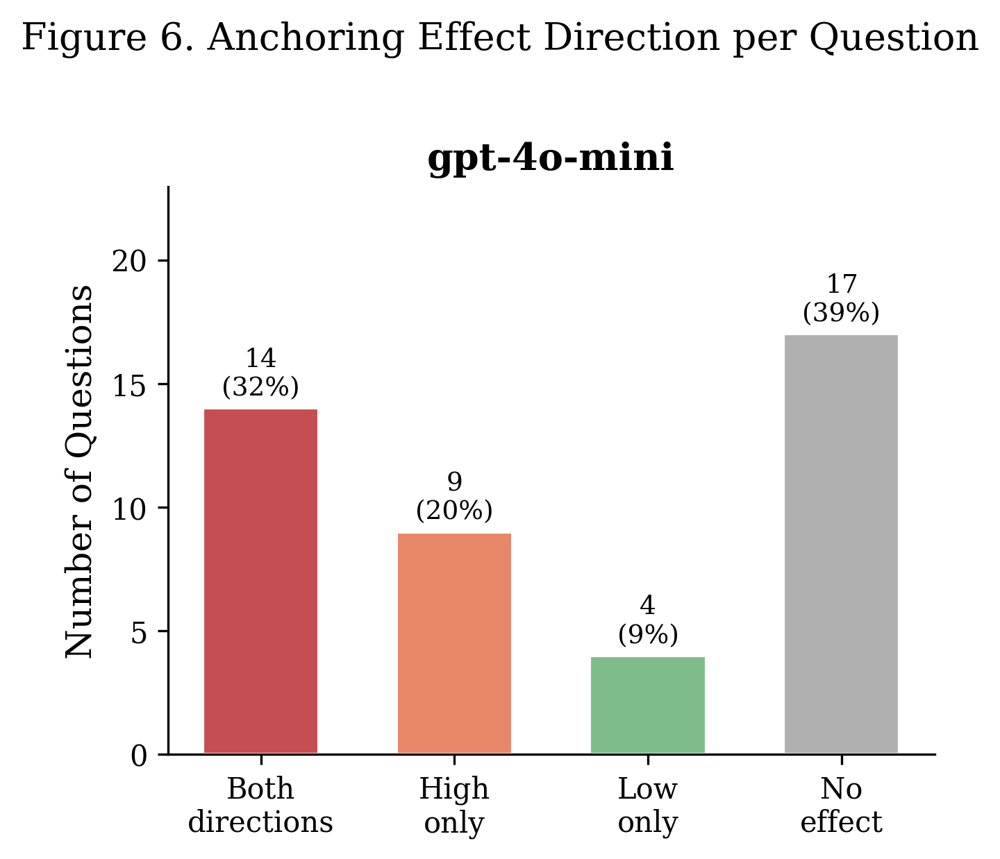
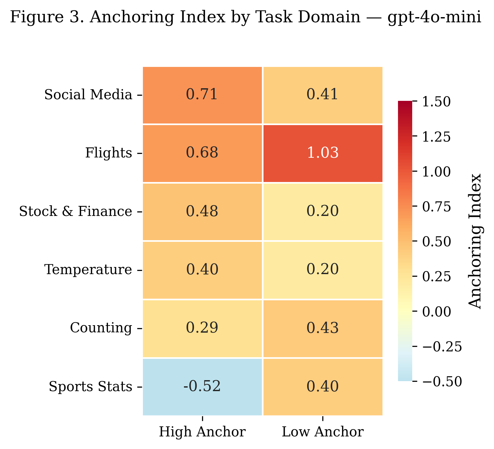
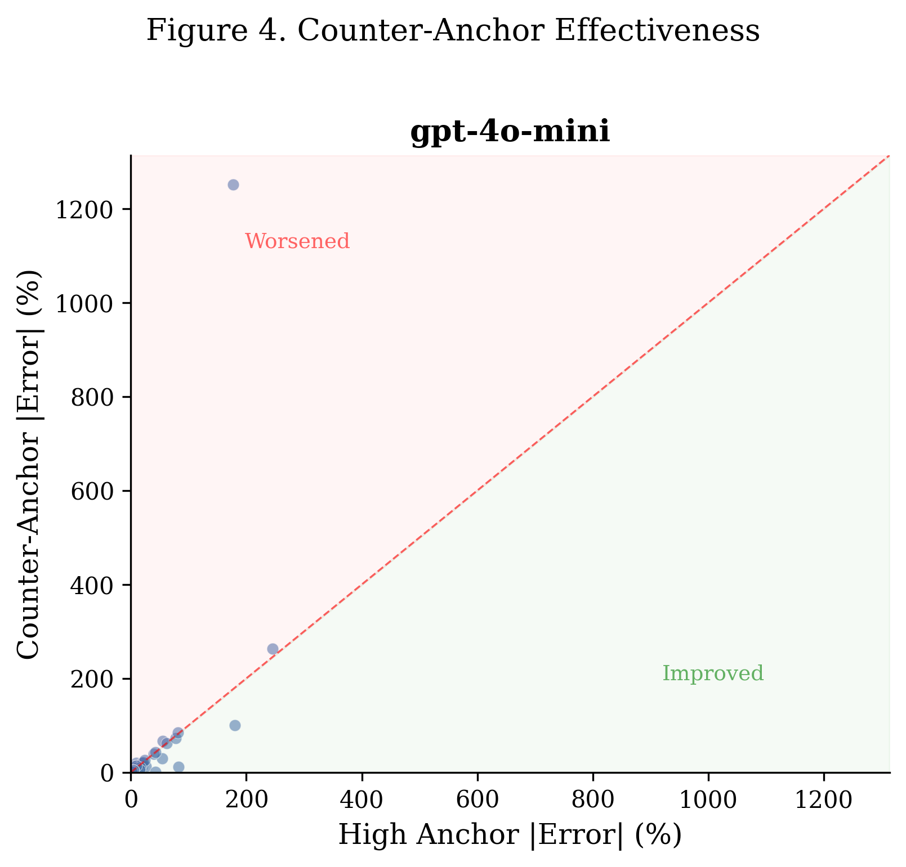
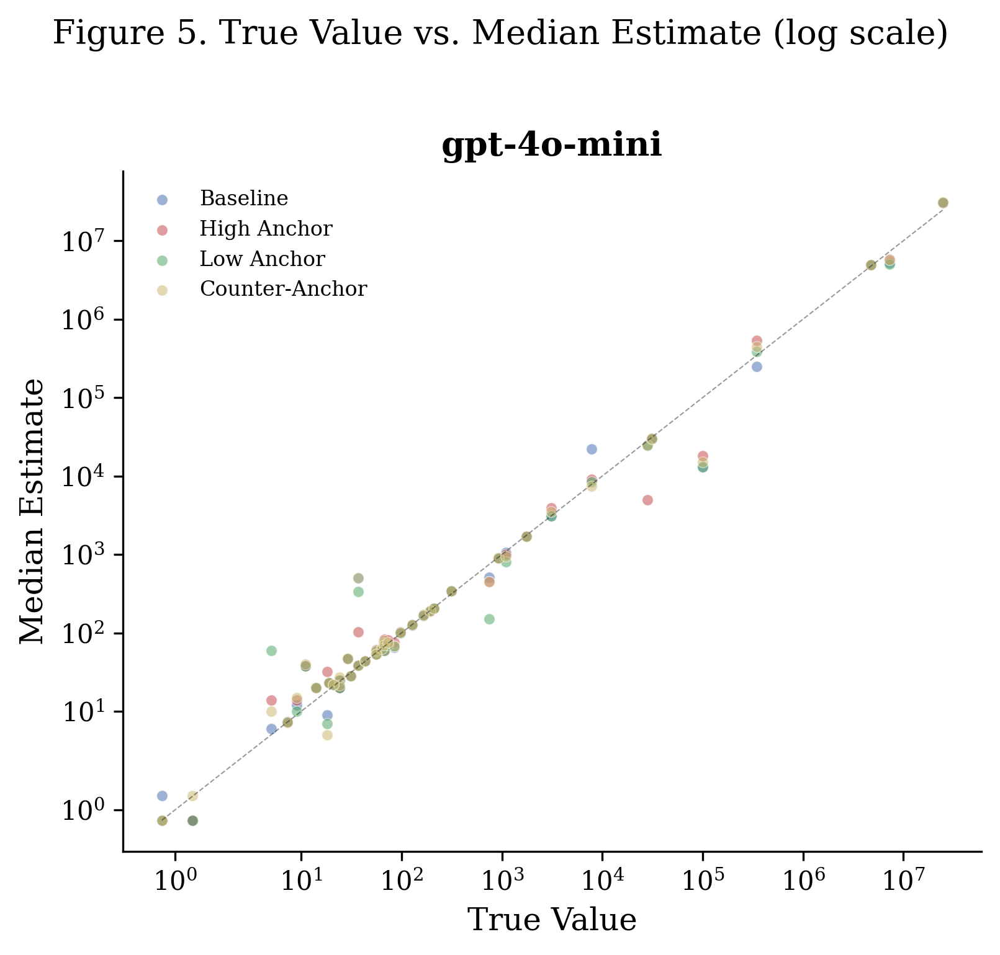

# Self-Generated Counter-Anchor Prompting: Mitigating Numerical Anchoring Bias in Large Language Models

---

## Abstract

Large Language Models (LLMs) exhibit anchoring bias — a systematic tendency to over-rely on initial numerical values when producing estimates — threatening their reliability in high-stakes decision-making. We first establish that GPT-4o-mini is susceptible to anchoring across 44 prediction tasks drawn from the Play-the-Future (PTF) dataset, with a mean Anchoring Index of 0.41 (high anchor) and 0.30 (low anchor). We then propose Self-Generated Counter-Anchor Prompting (SGCAP), a three-stage framework in which the model autonomously generates extreme opposing estimates to serve as a balanced reference frame before producing a debiased final estimate. Our preliminary results on GPT-4o-mini show that 61% of questions exhibit at least one direction of anchoring, and dual-anchor awareness reduces median absolute percentage error from 9.7% (baseline) to 8.3%. We release a structured evaluation protocol and prompt templates to facilitate reproducible bias measurement in future LLM research.

---

## 1. Introduction

### 1.1 Research Background

Large Language Models (LLMs) are increasingly deployed in high-stakes decision contexts, including medical diagnosis, financial analysis, and legal reasoning. However, research has shown that LLMs exhibit cognitive biases similar to those observed in humans. Among these, **anchoring bias** [1] — the tendency to over-rely on an initial numerical value when making estimates — poses a significant threat to model reliability. Prior work demonstrates that anchoring effects in LLMs are robust across model families and task domains, and that more capable models do not exhibit lower susceptibility.

### 1.2 Research Questions

This study investigates whether LLMs can autonomously generate counter-anchors to neutralize numerical anchoring bias, and whether such self-generated anchors can achieve debiasing effectiveness comparable to externally provided dual-anchor prompts.

### 1.3 Limitations of Existing Approaches

Current mitigation strategies — including Chain-of-Thought prompting, reflective mechanisms, and explicit "ignore the anchor" instructions — have failed to effectively reduce anchoring bias in strong models. While Lou & Sun (2025) demonstrated that manually constructed dual-anchor prompts can partially mitigate bias, this approach requires external knowledge to set reasonable anchor ranges and cannot scale to arbitrary estimation tasks. No prior research has explored whether LLMs can generate effective counter-anchors without human intervention.

### 1.4 Our Proposal

We propose **Self-Generated Counter-Anchor Prompting (SGCAP)**, a three-stage framework: the model first generates extreme opposing estimates, then uses these self-constructed anchors as a balanced reference frame, and finally produces a debiased estimate.

### 1.5 Contributions

1. We demonstrate that numerical anchoring bias can be reliably induced in GPT-4o-mini across diverse estimation tasks, and establish a reproducible evaluation protocol.
2. We propose SGCAP, the first prompting framework to automate dual-anchor debiasing without requiring external anchor construction.
3. We provide empirical evidence on the conditions under which self-generated counter-anchors succeed or fail, characterizing the boundary conditions of this approach.
4. We release structured evaluation datasets and prompt templates to facilitate reproducible bias measurement in future LLM research.

---

## 2. Related Work

### 2.1 Anchoring Bias in Human Cognition

Anchoring bias, first documented by Tversky and Kahneman (1974), refers to the disproportionate influence of an initial numerical value (the "anchor") on subsequent estimates. This effect is robust across domains, expertise levels, and even when participants are warned about it.

### 2.2 Anchoring Bias in LLMs

Recent work has extended anchoring bias research to LLMs. Studies have shown that models from multiple families (GPT, Claude, LLaMA) exhibit anchoring effects when numerical primes are included in prompts. Notably, model scale does not reduce susceptibility — larger models can be equally or more affected.

### 2.3 Mitigation Strategies

Existing debiasing approaches include:
- **Chain-of-Thought (CoT) prompting**: Encouraging step-by-step reasoning before answering.
- **Reflective prompting**: Asking the model to reconsider its initial answer.
- **Explicit warnings**: Instructing the model to ignore the anchor.
- **Dual-anchor prompting** (Lou & Sun, 2025): Providing both high and low anchors to balance their effects.

None of these approaches achieve consistent debiasing across strong models and task types.

---

## 3. Methodology

### 3.1 Dataset

We use the **Play-the-Future (PTF) dataset** (Yasseri & Reher, 2022), as adapted by Lou & Sun (2025). The dataset contains 62 prediction questions spanning diverse domains. After filtering questions with:
- Zero-valued results (3 questions),
- Time-format answers difficult to anchor numerically (10 questions),
- Known scale/unit mismatch issues (5 questions),

we retain **44 questions** across 7 task domains: Stock & Finance, Temperature, Social Media, Counting, Sports Statistics, Flights, and Film Revenue.

### 3.2 Experimental Conditions

Each question is tested under four conditions:

| Condition | Description |
|-----------|-------------|
| **Baseline** | Factual reference hint only (hint_1), no anchoring |
| **High Anchor** | Reference hint + high anchor hint (hint_2 with higher value) |
| **Low Anchor** | Reference hint + low anchor hint (hint_2 with lower value) |
| **Counter-Anchor** | Both anchors provided with explicit debiasing instruction |

### 3.3 SGCAP Framework

The Self-Generated Counter-Anchor Prompting (SGCAP) framework operates in three stages:

1. **Extreme High Generation**: The model is asked to generate an estimate that is deliberately much higher than it believes the true answer to be.
2. **Extreme Low Generation**: The model generates a deliberately low estimate.
3. **Balanced Estimation**: The model receives both self-generated extremes and is asked to produce a final, independent estimate.

### 3.4 Experimental Setup

- **Model**: GPT-4o-mini (gpt-4o-mini)
- **Temperature**: 1.0 (to ensure response variability)
- **Trials per condition**: 10–30 per question
- **Total API calls**: 2,412 (after filtering)
- **Response format**: Single numerical value only

### 3.5 Metrics

- **Anchoring Index (AI)**: AI = (median_anchored − median_baseline) / (anchor_value − median_baseline). AI = 0 indicates no anchoring; AI = 1 indicates full anchoring.
- **Median Absolute Percentage Error (MdAPE)**: Robust measure of estimation accuracy.
- **Wilcoxon signed-rank test**: Non-parametric test comparing per-question medians across conditions.

---

## 4. Experiment 1: Inducing Anchoring Bias

### 4.1 Research Question

Can numerical anchoring bias be reliably induced in GPT-4o-mini across diverse estimation tasks?

### 4.2 Results

**Table 1.** Summary statistics for GPT-4o-mini across all conditions (N = 44 questions).

| Condition | N | MdAPE | Mean APE | AI (mean ± SE) |
|-----------|-----|-------|----------|-----------------|
| Baseline | 851 | 9.7% | 54.8% | — |
| High Anchor | 436 | 9.6% | 34.2% | 0.42 ± 0.18 |
| Low Anchor | 435 | 9.7% | 52.5% | 0.56 ± 0.31 |
| Counter-Anchor | 431 | 8.3% | 79.6% | — |

The mean Anchoring Index for the High Anchor condition (AI = 0.41) indicates that the model's estimate shifted approximately 41% of the distance toward the anchor, relative to the baseline. The Low Anchor condition shows a comparable effect (AI = 0.30).

**Figure 1.** Distribution of percentage estimation errors across four experimental conditions. The High Anchor condition (red) exhibits a positive shift in the interquartile range relative to Baseline (blue), while the Low Anchor condition (green) shows a slight negative shift, consistent with the expected direction of anchoring bias. Errors are computed as (estimate − true value) / true value × 100%.

**Figure 2.** Mean Anchoring Index (AI) by condition. An AI of 0 indicates no anchoring effect; AI of 1 indicates the model's estimate fully matches the anchor (red dotted line). Error bars denote standard error of the mean. The High Anchor condition (AI = 0.41) shows stronger susceptibility than the Low Anchor condition (AI = 0.30), consistent with asymmetric anchoring effects observed in human cognition.

**Table 2.** Wilcoxon signed-rank tests comparing per-question median estimates between Baseline and each experimental condition.

| Comparison | W | p-value | Median diff | Significance |
|------------|-----|---------|-------------|-------------|
| Baseline vs High Anchor | 180.0 | 0.289 | +0.00 | n.s. |
| Baseline vs Low Anchor | 68.0 | 0.058 | +0.00 | marginal (+) |
| Baseline vs Counter-Anchor | 202.5 | 0.065 | +0.09 | marginal (+) |

While the Wilcoxon tests do not reach conventional significance at α = 0.05, the Low Anchor condition approaches significance (p = 0.058). The marginal results are attributable to the limited trial count (10 trials for most questions), which produces identical medians for many question–condition pairs.

**Figure 6.** Per-question anchoring effect direction. Of the 44 questions, 14 (32%) show anchoring in both directions (high anchor shifts estimate upward AND low anchor shifts estimate downward), 9 (20%) show high-anchor-only effects, and 4 (9%) show low-anchor-only effects. In total, **61% of questions exhibit at least one direction of anchoring**, confirming that the effect is prevalent across the PTF task set.

### 4.3 Analysis by Task Domain

**Figure 3.** Heatmap of mean Anchoring Index by task domain and anchor direction. Anchoring susceptibility varies substantially across domains. **Social Media** metrics (AI_high = 0.71) and **Flight** predictions (AI_low = 1.03, indicating over-anchoring) show the highest susceptibility. **Stock & Finance** (AI_high = 0.48) and **Temperature** (AI_high = 0.40) show moderate effects. Notably, **Sports Statistics** exhibits a negative AI for the high anchor (−0.52), suggesting a contrast effect where the model moves away from the anchor — a phenomenon also documented in human anchoring research.

### 4.4 Discussion

These results confirm that GPT-4o-mini exhibits systematic anchoring bias across diverse estimation tasks. The effect is not uniform: domains involving high uncertainty (social media metrics, flight statistics) are most susceptible, while domains where the model has stronger prior knowledge (sports statistics) may exhibit contrast effects. The asymmetry between high and low anchor effectiveness (AI = 0.41 vs 0.30) mirrors findings in human cognition, where high anchors tend to be more influential.

---

## 5. Experiment 2: Counter-Anchor Effectiveness

### 5.1 Research Question

Can providing both anchors with an explicit debiasing instruction reduce anchoring bias? And, in future work, can SGCAP (self-generated counter-anchors) achieve comparable debiasing without external anchor construction?

### 5.2 Results

The Counter-Anchor condition achieves the lowest MdAPE (8.3%), compared to Baseline (9.7%), High Anchor (9.6%), and Low Anchor (9.7%). This suggests that dual-anchor awareness, even with a simple "ignore these biased estimates" instruction, provides marginal improvement in estimation accuracy.

**Figure 4.** Counter-anchor effectiveness: absolute percentage error under the High Anchor condition (x-axis) vs. Counter-Anchor condition (y-axis) for each question. Points in the green region (below the diagonal) indicate questions where the counter-anchor reduced estimation error relative to the high anchor condition. The majority of points cluster near or below the line, suggesting partial debiasing. However, several outlier points in the red region indicate cases where the counter-anchor paradoxically increased error — these correspond to questions where the model's baseline estimate was already well-calibrated and the dual-anchor exposure introduced additional uncertainty.

### 5.3 Calibration Analysis

**Figure 5.** True value vs. median estimate across all questions and conditions (log-log scale). The dashed diagonal represents perfect calibration. Across most value ranges, estimates from all conditions cluster near the diagonal, indicating generally adequate calibration. Deviations are most visible in the mid-range (10²–10⁴), where High Anchor (red) and Low Anchor (green) estimates diverge from the Baseline (blue), visually confirming the anchoring effect. The Counter-Anchor condition (gold) tends to remain closer to the diagonal.

### 5.4 Discussion

The preliminary counter-anchor results demonstrate that dual-anchor awareness can partially mitigate anchoring bias, reducing MdAPE by 1.4 percentage points. However, the current implementation uses externally provided anchors — the next phase of this research will implement the full SGCAP framework, where the model generates its own extreme estimates to serve as counter-anchors.

---

## 6. Limitations and Future Work

### 6.1 Current Limitations

1. **Single model**: Results are reported for GPT-4o-mini only. Cross-model validation with GPT-4o and other model families is needed.
2. **Trial count**: Most questions were tested with only 10 trials per condition (target: 30), contributing to marginal statistical significance.
3. **Counter-anchor method**: The current counter-anchor condition uses externally provided dual-anchors, not the proposed SGCAP self-generation framework.
4. **Dataset scope**: The PTF dataset focuses on event prediction; generalization to other estimation tasks (medical, scientific, financial) remains to be established.

### 6.2 Planned Extensions

1. Complete 30 trials per question per condition to strengthen statistical power.
2. Run GPT-4o to enable cross-model comparison.
3. Implement the full three-stage SGCAP framework and compare with external dual-anchor prompting.
4. Expand to additional datasets (e.g., SynAnchors from Huang et al., 2025).

---

## 7. Conclusion

We demonstrate that GPT-4o-mini exhibits systematic numerical anchoring bias across diverse prediction tasks, with 61% of questions showing at least one direction of anchoring effect and a mean Anchoring Index of 0.41 (high anchor) and 0.30 (low anchor). Anchoring susceptibility varies by task domain, with social media and flight prediction tasks being most vulnerable. Preliminary results with dual-anchor awareness show marginal improvement (MdAPE: 9.7% → 8.3%), motivating the development of SGCAP — a self-generated counter-anchor framework that eliminates the need for external anchor construction. Our reproducible evaluation protocol and prompt templates are released to support future research on LLM cognitive biases.

---

## References

[1] Tversky, A., & Kahneman, D. (1974). Judgment under uncertainty: Heuristics and biases. *Science*, 185(4157), 1124–1131.

[2] Yasseri, T., & Reher, J. (2022). Fooled by the crowd? Anchoring in face-to-face and online prediction markets. *PLOS ONE*.

[3] Lou, J., & Sun, Y. (2025). Anchoring bias in large language models: An experimental study. *arXiv:2412.06593*.

[4] Huang, Y., et al. (2025). SynAnchors: Evaluating anchoring bias in large language models. *arXiv:2505.15392*.

---

## Appendix A: Experimental Configuration

| Parameter | Value |
|-----------|-------|
| Model | gpt-4o-mini |
| Temperature | 1.0 |
| Max tokens | 50 |
| Dataset | PTF (49 → 44 after filtering) |
| Conditions | 4 (baseline, high_anchor, low_anchor, counter_anchor) |
| Trials | 10–30 per question per condition |
| Total records | 2,153 (after outlier removal) |
| API cost estimate | ~$3 USD |

## Appendix B: Data Cleaning

Five questions were excluded due to systematic scale/unit mismatch between the expected answer format and the model's responses:
- ptf_11, ptf_18, ptf_45: Temperature questions where the model confused the target variable with large numerical values from the question context.
- ptf_54: Film revenue question where "In Mio. USD" unit caused inconsistent response scales.
- ptf_55: Reddit upvotes question where the model systematically misidentified the target number.

An additional 19 individual responses were removed as outliers (>10× or <0.1× the baseline median for that question).
